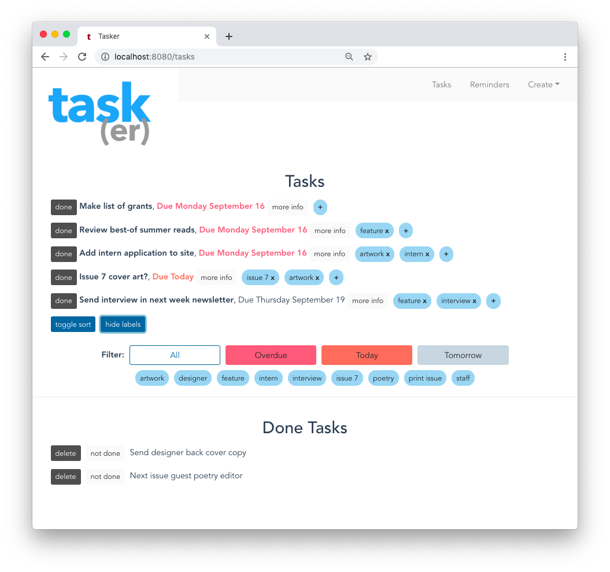

# tasker-vue-cli-3

Tasker is a product management suite under construction for [Cagibi](https://cagibilit.com/). Built on Vue CLI 3, this is the front-end component, to create, manage and delete tasks and reminders.

> Together with its separate Task API project, this is a demo of a containerized Node.js, Vue.js, MongoDB, RESTful API microservices application.



## Built With

-   [Vue CLI 3](https://cli.vuejs.org/), [Vue Router](https://router.vuejs.org/)
-   [axios](https://www.npmjs.com/package/axios): Promise based HTTP client
-   [Bootstrap](https://getbootstrap.com/): Front-end framework along with [BootstrapVue](BootstrapVue), [JQuery](https://jquery.com/)
-   [Moment.js](https://momentjs.com/): Parse, validate, manipulate, and display dates and times
-   [Prettier](https://prettier.io/): code formatting

## Project setup

```
npm install
```

### Compiles and hot-reloads for development

```
npm run serve
```

### Compiles and minifies for production

```
npm run build
```

### Run your tests

```
npm run test
```

### Lints and fixes files

```
npm run lint
```

### Run your unit tests

```
npm run test:unit
```

### Customize configuration

See [Configuration Reference](https://cli.vuejs.org/config/).
